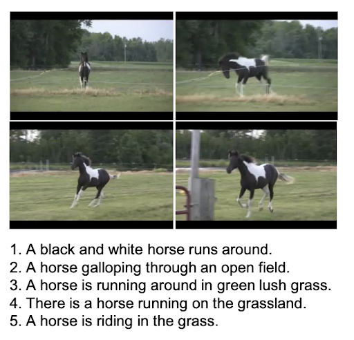
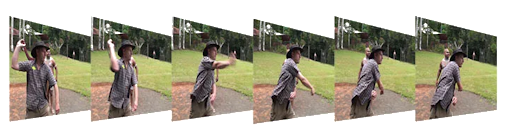
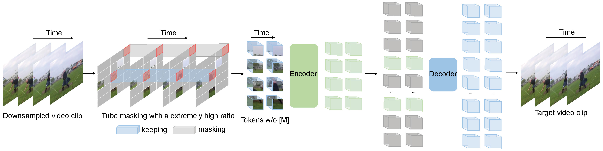
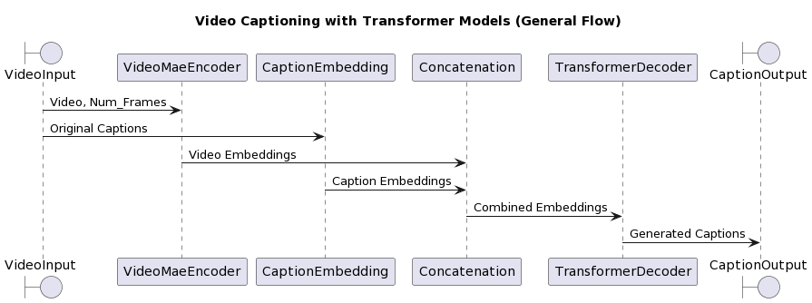

# Video Caption

## Table of Contents

**TODO:** Use ChatGPT

## Team Information

- Team Members
  - Daniel Martín ([danitiana98@gmail.com](mailto:danitiana98@gmail.com))
  - Joan Pascual **TODO:** add mail
  - Juan Bacardit **TODO:** add mail
  - Sergi Taramon **TODO:** add mail
- Advisor: Carlos Escolano
- Framework: ``pytorch``

## Introduction

Nowadays we have access to enormous volumes of video data. However, the information contained in these videos is not easily accessible. The goal of this project is to generate a brief description of a small video. This description will be generated by a transformer decoder that will receive encoded videos using a pre-trained model.

These transcriptions have lots of potential applications, such as:

- Video indexing
- Video retrieval
- Video summarization

## Project Goals

Generate a representative brief description of a small video by:

- Use transfer learning though a pre-trained VideoMAE encoder to encode video information.
- Implement transformer decoder to generate captions.
- Train a transformer decoder to generate captions explaining the video content.
- Achieve valid and accurate captions explaining what happens in a given video input.
- Deploy built solution on Google Cloud (revised)

## Environment Setup

### Dependencies

To run this project you will need to install the following dependencies:

- [Python 3.10](https://www.python.org/downloads/release/python-310)
- [Poetry](https://python-poetry.org/docs/#installation)
- [Project dependencies](./pyproject.toml)
- [Docker](https://docs.docker.com/get-docker/) (optional)

### Cloning and first steps

```shell
git clone https://github.com/dainelli98/video_caption.git
```

After having cloned the repo, if not using docker, create a virtual environment and install Python packages:

```shell
make venv
```

### Installation

Install package via pip using:

```shell
pip install -e .
```

### Poetry

To include a new package to the project it has to be added into the pyproject.toml
under the correct group. Application packages have to be included inside `tool.poetry.dependencies`.
Other packages have to be included in their respective groups like dev, docs or custom groups.

To add a package run `poetry add [options] [--] <name>`. You can indicate the group to
add the dependency to with the option `--group=GROUP`.

To remove a package run `poetry remove [options] [--] <packages>`. You can indicate the group to
remove the dependency from with the option `--group=GROUP`.

To update the `poetry.lock` file, run `poetry lock --no-update`.

Run `poetry list` to get more information about all the commands that poetry can run.

### Generate documentation

Run the following command to generate project API documentation:

```shell
make docs
```

## Dataset. MSR-VTT 10K

The dataset selected was MSR-VTT 10K. MSR-VTT provides 10K web video clips with 41.2 hours and 200K clip-sentence pairs in total, covering the most comprehensive categories and diverse visual content, and representing the largest dataset in terms of sentence and vocabulary. Each clip is annotated with about 20 natural sentences by 1,327 AMT workers. Total captions contain ~29k unique words.



### Dataset metadata

All video info and caption sentences are stored using the JSON file format. All data share the basic data structure below:

```json
{
  "info" : info,
  "videos": [video],
  "sentences": [sentence],
}

info {
  "year" : str,
  "version" : str,
  "description": str,
  "contributor": str,
  "data_created": str,
}

video {
  "id": int,
  "video_id": str,
  "category": int,
  "url": str,
  "start time": float,
  "end time": float,
  "split": str,
}

sentence {
  "sen_id": int,
  "video_id": str,
  "caption": str,
}
```

Example:

```json
{
  "info":
  {
    "contributor": "Microsoft MSM group",
    "data_created": "2016-04-14 14:30:20",
    "version": "1.0",
    "description": "This is 1.0 version of the 2016 MSR-VTT dataset.", "year": "2016"
  },
  "videos":
  [
    {
      "category": 9,
      "url": "https://www.youtube.com/watch?v=9lZi22qLlEo",
      "video_id": "video0",
      "start time": 137.72,
      "end time": 149.44, "split": "train", "id": 0},
    {
      "category": 16,
      "url": "https://www.youtube.com/watch?v=w4JM08PDEng",
      "video_id": "video1",
      "start time": 184.33,
      "end time": 206.89,
      "split": "train",
      "id": 1
    }
    ...
  ],
  "sentences":
  [
    {
      "sen_id": 0,
      "video_id": "video0",
      "caption": "A person is drawing a picture."
    },
    {
      "sen_id": 1,
      "video_id": "video0",
      "caption": "A person is drawing a picture."
    }
    ...
  ]
```

Using the above data structure, we can easily download the videos from YouTube using the video_id and the start and end time. We can also download the captions using the video_id and the caption.

Also, the videos can be found already extracted from YouTube in [Mediafire](https://www.mediafire.com/folder/h14iarbs62e7p/shared).

### Data splits

| Splits | Init     | End      | # Videos | # Captions/Video |
|--------|----------|----------|----------|------------------|
| Train  | video0   | video6512| 6513     | 20               |
| Val    | video6513| video7009| 497      | 20               |
| Test   | video7010| video9999| 2990     | 20               |

## Methods/Algorithms Used

### Video Encoding

We used the predefined distribution of the original dataset (Train:6513, Val:497 and Test:2990). In order to transform the original data set that contains videos and related captions, we decided to use an existing model as a transformer encoder in order to generate the corresponding embeddings for the videos and correlate those video embeddings with the captions.

#### Frame extraction

Our initial implementation extracts 16 evenly spaced frames from each video.

We considered iterating and use ``FFmpeg`` to extract the 16 most representative frames from each video, but we decided to keep the first approach as the results were good enough.



#### VideoMAE as video encoder

VideoMAE, standing for Video Masked Autoencoder, is a self-supervised video pre-training approach designed for efficient learning from video data. It was proposed in the paper ["VideoMAE: Masked Autoencoders are Data-Efficient Learners for Self-Supervised Video Pre-Training"](https://arxiv.org/abs/2203.12602).

Key characteristics and features of VideoMAE include:

- High masking ratio (between 90% and 95%) in its training process. Despite the extensive masking, VideoMAE still performs well due to the temporally redundant content in videos, which allows for meaningful reconstruction from limited data.
- Demonstrates impressive results on small datasets (around 3k-4k videos) without needing additional data. This makes it a data-efficient learner in the field of self-supervised video pre-training.
- Emphasis on Data Quality: The authors of VideoMAE found that the quality of the data is more important than the quantity for self-supervised video pre-training. The domain shift, or the difference between the pre-training and target datasets, is also an important factor to consider.
- Effective Video Representations: By making video reconstruction a challenging task, VideoMAE encourages the extraction of more effective video representations during the pre-training process. This makes it particularly useful for tasks that require understanding and interpreting video content.
- When implemented with the vanilla ViT (Vision Transformer) backbone, achieved high performance on various video understanding benchmarks, including Kinects-400, Something-Something V2, UCF101, and HMDB51, without using any extra data.

We used the implementation that could be found on [Hugging Face](https://huggingface.co/docs/transformers/main/model_doc/videomae).



Utilizing the VideoMAE model, we have generated several comprehensive datasets. Each dataset is characterized by unique parameters such as video frame rate, embedding sampling period (i.e., selecting one vector every X frames), tensor representation of each video, and overall dataset size.

#### Video encoding postprocessing

Even if the original videos do amount to no more than 7 GB, the generated embeddings are much larger. This is due to the fact that the original videos leverage mp4 compression, which would not take effect when loading memory.

This raised the need to reduce the size of the generated embeddings for easy experimentation.

To reduce dataset size, we used 2 different methodologies, reducing float precision and embedding sampling.

First, we reduced the precision of the values in the embedding by casting them from ``float32`` to ``float16``.

The comprehensive embedding representation derived from the VideoMAE model is a tensor of dimensions [1,1568, 768]. To streamline usage during the model development phase, we generated several datasets by performing different levels of sampling (taking one of each ``n`` vectors per embedding). This approach involved utilizing a low sampling representation during the initial stages of model development and stabilization. Once the model was stable, larger representation datasets were employed during the experimental or training execution phase. This strategy ensured manageable data handling without compromising the robustness of our experiments too much.

The experiments performed posterior to the generation of the datasets showed that this strategy produced datasets that contained representative information.

#### Final preprocessed datasets

The table below provides a summary of the generated datasets:

- Original embeddings: 32-bit floating point representation of the embeddings without any sampling.

- Reduced precision embeddings: 16-bit floating point representation of the embeddings without any sampling.

- Sampled embeddings: 16-bit floating point representation of the embeddings with sampling at different levels (2, 4, 8, 16, 32).

- No-sampling datasets: These datasets were generated with a video frame rate of 27 frames/sec. The tensor representation for each video is [1,1568,768] with int64 type, and the overall size of the dataset is 41.50 GB. The dataset is saved under the name "dataset".

| Embedding sampling period (pick one vector every X) | Embed dims/video | Tensor Dtype | Dataset Size |
| --------------------------------------------------- | ---------------- | ------------ | ------------ |
| No-sampling                                         | [1,1568,768]     | float32      | 41.50 GB     |
| No-sampling                                         | [1,1568,768]     | float16      | 20.74 GB     |
| 2                                                   | [1,784,768]      | float16      | 10.38 GB     |
| 4                                                   | [1,392,768]      | float16      | 10.13 GB     |
| 8                                                   | [1,196,768]      | float16      | 2.6 GB       |
| 16                                                  | [1,98,768]       | float16      | 1.3 GB       |
| 32                                                  | [1,49,768]       | float16      | 645 MB       |

### Transformer Decoder

**TODO:**

#### Model Architecture

**TODO:**

#### General data flow



## Experiments

- **TODO:** Experiments

## Results Summary

- **TODO:** Summary of results

## Conclusions

**TODO:**

## Next Steps

**TODO:**

## References

- [MSR-VTT: A Large Video Description Dataset for Bridging Video and Language](https://www.microsoft.com/en-us/research/wp-content/uploads/2016/06/cvpr16.msr-vtt.tmei_-1.pdf)
- [VideoMAE: Masked Autoencoders are Data-Efficient Learners for Self-Supervised Video Pre-Training](https://arxiv.org/abs/2203.12602)
- [VideoMAE Huggingface](https://huggingface.co/docs/transformers/main/model_doc/videomae)

**TODO:**
