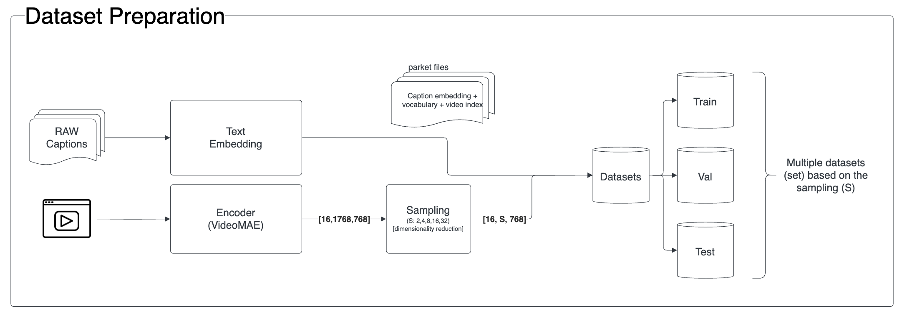
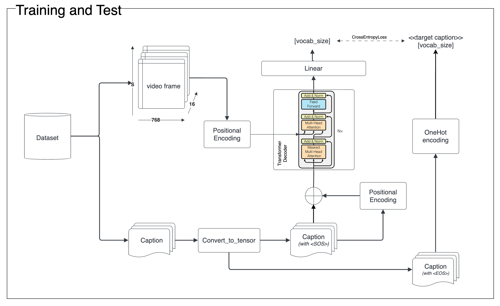
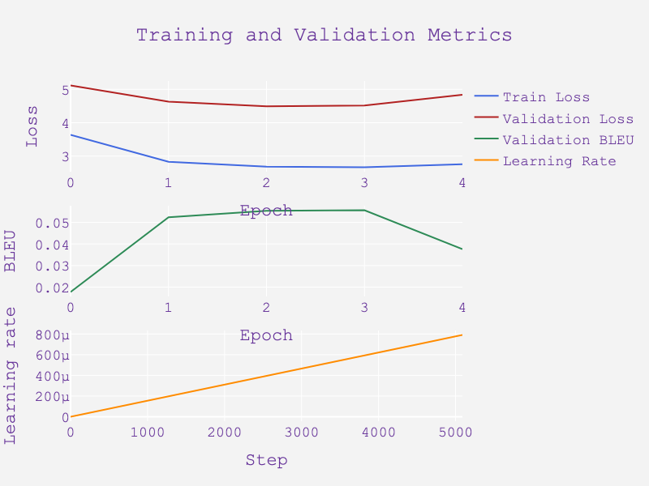

# Video Caption

## Table of Contents

- [Team Information](#team-information)
- [Introduction](#introduction)
- [Project Goals](#project-goals)
- [Environment Setup](#environment-setup)
- [Running the project](#running-the-project)
- [Dataset. MSR-VTT 10K](#dataset-msr-vtt-10k)
- [Method and Algorithms Used](#methods-and-algorithms-used)
- [Experiments](#experiments)
- [Results](#results)
- [Conclusions](#conclusions)
- [Next Steps](#next-steps)
- [References](#references)


## Team Information

- Team Members
  - Daniel Martín ([danitiana98@gmail.com](mailto:danitiana98@gmail.com))
  - Joan Pascual
([joanpascualgrau@gmail.com](mailto:joanpascualgrau@gmail.com))
  - Sergi Taramon
([sergitaramon21@gmail.com](mailto:sergitaramon21@gmail.com))
  - Juan Bacardit ([juanbacardit@gmail.com](mailto:juanbacardit@gmail.com))
- Advisor: Carlos Escolano
- Framework: ``pytorch``

## Introduction

Nowadays we have access to enormous volumes of video data. However, the information contained in these videos is not easily accessible. The goal of this project is to generate a brief description of a small video. This description will be generated by a transformer decoder that will receive encoded videos using a pre-trained model.

These transcriptions have lots of potential applications, such as:

- Video indexing
- Video retrieval
- Video summarization

## Project Goals

Generate a representative brief description of a small video by:

- Use transfer learning though a pre-trained VideoMAE encoder to encode video information.
- Implement transformer decoder to generate captions.
- Train a transformer decoder to generate captions explaining the video content.
- Achieve valid and accurate captions explaining what happens in a given video input.

## Environment Setup

### Dependencies

To run this project you will need to install the following dependencies:

- [Python 3.10](https://www.python.org/downloads/release/python-310)
- [Poetry](https://python-poetry.org/docs/#installation)
- [Project dependencies](./pyproject.toml)
- [Docker](https://docs.docker.com/get-docker/) (optional)

### Cloning and first steps

```shell
$ git clone https://github.com/dainelli98/video_caption.git
```

After having cloned the repo create a virtual environment and install Python packages:

```shell
$ make venv
```

### Installation

Install package via pip using:

```shell
$ pip install -e .
```

### Poetry

To include a new package to the project it has to be added into the ``pyproject.toml`` file under the correct group. Application packages have to be included inside ``tool.poetry.dependencies``.

Other packages have to be included in their respective groups like dev, docs or custom groups.

To add a package run ``poetry add [options] [--] <name>``. You can indicate the group to add the dependency to with the option ``--group=GROUP``.

To remove a package run ``poetry remove [options] [--] <packages>``. You can indicate the group to remove the dependency from with the option ``--group=GROUP``.

To update the ``poetry.lock`` file, run ``poetry lock --no-update``.

Run ``poetry list`` to get more information about all the commands that poetry can run.

### Generate documentation

Run the following command to generate project API documentation:

```shell
$ make docs
```

## Running the project

This projects provides 4 commands that can be run and configured using CLI:

- ``prepare-dataset``
- ``train``
- ``test``
- ``experiment``

To get information about the arguments that each command accepts, run:

```shell
$ vid-cap --help

Usage: vid-cap [OPTIONS] COMMAND1 [ARGS]... [COMMAND2 [ARGS]...]...

  Train and evaluate model to obtain video descriptions from videos.

Options:
  --version  Show the version and exit.
  --help     Show this message and exit.
```

### Prepare dataset

To run the script that prepares the video encoding dataset, run:

```shell
$ vid-cap prepare-dataset
```

To obtain information about the arguments that this command accepts, run:

```shell
$ vid-cap prepare-dataset --help

Usage: vid-cap prepare-dataset [OPTIONS]

  Prepare dataset with VideoMAE.

Options:
  --data-dir PATH  Data directory
  --help           Show this message and exit.
```

### Train

To run the script to train the model, run:

```shell
$ vid-cap train
```

To obtain information about the arguments that this command accepts, run:

```shell
$ vid-cap train --help

Usage: vid-cap train [OPTIONS]

  Train decoder.

Options:
  --warmup-steps INTEGER RANGE    Warmup steps.  [1<=x<=100000]
  --label-smoothing FLOAT RANGE   Label smoothing.  [0<=x<=1]
  --data-dir PATH                 Data directory
  --shuffle                       Shuffle datasets
  --batch-size INTEGER RANGE      Batch size.  [1<=x<=512]
  --n-heads INTEGER RANGE         Number of heads.  [1<=x<=128]
  --n-layers INTEGER RANGE        Number of decoder layers.  [1<=x<=128]
  --use-gpu                       Try to train with GPU
  --epochs INTEGER RANGE          Number of epochs.  [1<=x<=10000]
  --vocab-len INTEGER RANGE       Vocab length. If BPE is used, this is
                                  ignored.  [1<=x<=100000]
  --caps-per-vid INTEGER RANGE    Captions per video used in the dataset.
                                  [1<=x<=20]
  --dropout FLOAT RANGE           Dropout rate.  [0<=x<=1]
  --bpe-num-operations INTEGER RANGE
                                  Number of BPE operations. If not provided,
                                  BPE will not be used.  [1<=x<=100000]
  --help                          Show this message and exit.
```

### Test

To run the script to evaluate the model, run:

```shell
$ vid-cap test
```

To obtain information about the arguments that this command accepts, run:

```shell
$ vid-cap test --help

Usage: vid-cap test [OPTIONS]

  Test decoder.

Options:
  --n-heads INTEGER RANGE     Number of heads.  [1<=x<=128]
  --data-dir PATH             Data directory
  --n-layers INTEGER RANGE    Number of decoder layers.  [1<=x<=128]
  --batch-size INTEGER RANGE  Batch size.  [1<=x<=512]
  --use-gpu                   Try to test with GPU
  --experiment-number TEXT    Number timestamp name on experiment folder.
                              [required]
  --help                      Show this message and exit.
```

### Experiment

To run the script that performs an experiment that trains and evaluates a model, run:

```shell
$ vid-cap experiment
```

To obtain information about the arguments that this command accepts, run:

```shell
$ vid-cap experiment --help

Usage: vid-cap experiment [OPTIONS]

  Perform experiement.

Options:
  --warmup-steps INTEGER RANGE    Warmup steps.  [1<=x<=100000]
  --label-smoothing FLOAT RANGE   Label smoothing.  [0<=x<=1]
  --data-dir PATH                 Data directory
  --shuffle                       Shuffle datasets
  --batch-size INTEGER RANGE      Batch size.  [1<=x<=512]
  --n-heads INTEGER RANGE         Number of heads.  [1<=x<=128]
  --n-layers INTEGER RANGE        Number of decoder layers.  [1<=x<=128]
  --use-gpu                       Try to train with GPU
  --epochs INTEGER RANGE          Number of epochs.  [1<=x<=10000]
  --vocab-len INTEGER RANGE       Vocab length. If BPE is used, this is
                                  ignored.  [1<=x<=100000]
  --caps-per-vid INTEGER RANGE    Captions per video used in the dataset.
                                  [1<=x<=20]
  --dropout FLOAT RANGE           Dropout rate.  [0<=x<=1]
  --bpe-num-operations INTEGER RANGE
                                  Number of BPE operations. If not provided,
                                  BPE will not be used.  [1<=x<=100000]
  --help                          Show this message and exit.
```

## Dataset. MSR-VTT 10K

The dataset selected was MSR-VTT 10K. MSR-VTT provides 10K web video clips with 41.2 hours and 200K clip-sentence pairs in total, covering the most comprehensive categories and diverse visual content, and representing the largest dataset in terms of sentence and vocabulary. Each clip is annotated with about 20 natural sentences by 1,327 AMT workers. Total captions contain ~29k unique words.


### Dataset metadata

All video info and caption sentences are stored using the JSON file format. All data share the basic data structure below:

```json
{
  "info" : info,
  "videos": [video],
  "sentences": [sentence],
}

info {
  "year" : str,
  "version" : str,
  "description": str,
  "contributor": str,
  "data_created": str,
}

video {
  "id": int,
  "video_id": str,
  "category": int,
  "url": str,
  "start time": float,
  "end time": float,
  "split": str,
}

sentence {
  "sen_id": int,
  "video_id": str,
  "caption": str,
}
```

Example:

```json
{
  "info":
  {
    "contributor": "Microsoft MSM group",
    "data_created": "2016-04-14 14:30:20",
    "version": "1.0",
    "description": "This is 1.0 version of the 2016 MSR-VTT dataset.", "year": "2016"
  },
  "videos":
  [
    {
      "category": 9,
      "url": "https://www.youtube.com/watch?v=9lZi22qLlEo",
      "video_id": "video0",
      "start time": 137.72,
      "end time": 149.44, "split": "train", "id": 0},
    {
      "category": 16,
      "url": "https://www.youtube.com/watch?v=w4JM08PDEng",
      "video_id": "video1",
      "start time": 184.33,
      "end time": 206.89,
      "split": "train",
      "id": 1
    }
    ...
  ],
  "sentences":
  [
    {
      "sen_id": 0,
      "video_id": "video0",
      "caption": "A person is drawing a picture."
    },
    {
      "sen_id": 1,
      "video_id": "video0",
      "caption": "A person is painting."
    }
    ...
  ]
```

Using the above data structure, we can easily download the videos from YouTube using the video_id and the start and end time. We can also download the captions using the video_id and the caption.

Also, the videos can be found already extracted from YouTube in [Mediafire](https://www.mediafire.com/folder/h14iarbs62e7p/shared).

### Data splits

| Splits | Init     | End      | # Videos | # Captions/Video |
|-------:|---------:|---------:|---------:|-----------------:|
| Train  | video0   | video6512| 6513     | 20               |
| Val    | video6513| video7009| 497      | 20               |
| Test   | video7010| video9999| 2990     | 20               |

## Methods and Algorithms Used

### Video Encoding

We used the predefined distribution of the original dataset (Train: 6513, Val: 497 and Test: 2990). In order to transform the original data set that contains videos and related captions, we decided to use an existing model as a transformer encoder in order to generate the corresponding embeddings for the videos and correlate those video embeddings with the captions.

We implemented a script [prepare_dataset](./vid_cap/scripts/prepare_dataset.py) that allows to generate video encodings with a giving sampling value.



#### Frame extraction

Our initial implementation extracts 16 evenly spaced frames from each video.

We considered iterating and use ``FFmpeg`` to extract the 16 most representative frames from each video, but we decided to keep the first approach as the results were good enough.


#### VideoMAE as video encoder

VideoMAE, standing for Video Masked Autoencoder, is a self-supervised video pre-training approach designed for efficient learning from video data. It was proposed in the paper ["VideoMAE: Masked Autoencoders are Data-Efficient Learners for Self-Supervised Video Pre-Training"](https://arxiv.org/abs/2203.12602).

Key characteristics and features of VideoMAE include:

- High masking ratio (between 90% and 95%) in its training process. Despite the extensive masking, VideoMAE still performs well due to the temporally redundant content in videos, which allows for meaningful reconstruction from limited data.
- Demonstrates impressive results on small datasets (around 3k-4k videos) without needing additional data. This makes it a data-efficient learner in the field of self-supervised video pre-training.
- Emphasis on Data Quality: The authors of VideoMAE found that the quality of the data is more important than the quantity for self-supervised video pre-training. The domain shift, or the difference between the pre-training and target datasets, is also an important factor to consider.
- Effective Video Representations: By making video reconstruction a challenging task, VideoMAE encourages the extraction of more effective video representations during the pre-training process. This makes it particularly useful for tasks that require understanding and interpreting video content.
- When implemented with the vanilla ViT (Vision Transformer) backbone, achieved high performance on various video understanding benchmarks, including Kinects-400, Something-Something V2, UCF101, and HMDB51, without using any extra data.

We used the implementation that could be found on [Hugging Face](https://huggingface.co/docs/transformers/main/model_doc/videomae).


Utilizing the VideoMAE model, we have generated several comprehensive datasets. Each dataset is characterized by unique parameters such as video frame rate, embedding sampling period (i.e., selecting one vector every X frames), tensor representation of each video, and overall dataset size.

#### Video encoding postprocessing

Even if the original videos do amount to no more than 7 GB, the generated embeddings are much larger. This is due to the fact that the original videos leverage mp4 compression, which would not take effect when loading memory.

This raised the need to reduce the size of the generated embeddings for easy experimentation.

To reduce dataset size, we used 2 different methodologies, reducing float precision and embedding sampling.

First, we reduced the precision of the values in the embedding by casting them from ``float32`` to ``float16``.

The comprehensive embedding representation derived from the VideoMAE model is a tensor of dimensions [1,1568, 768]. To streamline usage during the model development phase, we generated several datasets by performing different levels of sampling (taking one of each ``n`` vectors per embedding). This approach involved utilizing a low sampling representation during the initial stages of model development and stabilization. Once the model was stable, larger representation datasets were employed during the experimental or training execution phase. This strategy ensured manageable data handling without compromising the robustness of our experiments too much.

The experiments performed posterior to the generation of the datasets showed that this strategy produced datasets that contained representative information.

#### Final preprocessed datasets

The table below provides a summary of the generated datasets:

- Original embeddings: 32-bit floating point representation of the embeddings without any sampling.

- Reduced precision embeddings: 16-bit floating point representation of the embeddings without any sampling.

- Sampled embeddings: 16-bit floating point representation of the embeddings with sampling at different levels (2, 4, 8, 16, 32).

- No-sampling datasets: These datasets were generated with a video frame rate of 27 frames/sec. The tensor representation for each video is [1,1568,768] with int64 type, and the overall size of the dataset is 41.50 GB. The dataset is saved under the name "dataset".

| Embedding sampling period (pick one vector every X) | Embed dims/video | Tensor type | Dataset Size |
| ---------------------------------------------------:| ----------------:| -----------:| ------------:|
| No-sampling                                         | (1,1568,768)     | float32     | 41.50 GB     |
| No-sampling                                         | (1,1568,768)     | float16     | 20.74 GB     |
| 2                                                   | (1,784,768)      | float16     | 10.38 GB     |
| 4                                                   | (1,392,768)      | float16     | 10.13 GB     |
| 8                                                   | (1,196,768)      | float16     | 2.6 GB       |
| 16                                                  | (1,98,768)       | float16     | 1.3 GB       |
| 32                                                  | (1,49,768)       | float16     | 645 MB       |

### Transformer Decoder

We have defined a custom Transformer model with a decoder architecture. This model is composed by:

- Embedding Layer: this layer is responsible for converting input tokens into their corresponding embeddings. The size of the input is the vocabulary size and the output is the embedding dimension.
- Positional Encoding Layer: this layer adds positional information to the input embeddings, which is necessary for the Transformer model as it doesn't have any inherent notion of the position of tokens in a sequence.
- Transformer Decoder: this is the core of the Transformer model. It uses a Transformer decoder layer, which consists of a multi-head attention mechanism and a position-wise feed-forward network. The number of layers and attention heads, the activation function, and the dropout rate can all be specified when initializing the model. It also includes a masking mechanism to prevent attention to future positions in the sequence.
- Dense Layer: finally a linear layer that maps the output of the Transformer decoder to the vocabulary size, acting as a classifier over the entire vocabulary.



First of all we initialize the model. The weights of the embedding layer are uniformly initialized with a small range (-0.1 to 0.1).
Then during forward propagation, the input target sequence is passed through the embedding layer, the positional encoding layer, and the Transformer decoder and finally the output of the decoder is passed through the final dense layer.

#### Model Architecture

The final model should receive a video as input, process it and generate the final caption as an output. To generate predictions, we connect both the encoder and the decoder, the outcome component takes the video representation obtained from the encoder as its initial input. At each step, the decoder generates a token or element of the output sequence based on its current hidden state and the previously generated tokens. This process is typically performed iteratively until a predefined termination condition is met, such as reaching a maximum sequence length or generating an end-of-sequence token.


The model architecture described in the prior section can be seen in this [image](./report/images/render.png).


### Model training

We implemented a function with the [training logic](./vid_cap/modelling/train.py) that can be parameterized with the following arguments:

- Captions per video: Number of captions per video to use in training and validation.
- Vocabulary size: Number of words in the vocabulary.
- Batch size: Number of samples per batch.
- Shuffle: Whether to shuffle the training dataset or not.
- Label smoothing: Label smoothing value.
- Dropout: Dropout value.
- Warmup steps: Number of warmup steps.

We can also set the maximum number of epochs to train for, but in the end we decided to set a high number that never is reached, and instead we always use early stopping to stop training.

#### Loss Function

We used the cross-entropy loss function to calculate the loss between the predicted and the actual word.

#### Validation metric

The metric we used for validation is the BLEU score.

This metric is very popular in machine translation to compare a candidate translation of text to one or more reference translations. It quantifies the quality of the predicted text by checking how many subsequences match the reference target. The score ranges from 0 to 1 where 1 means a perfect match with the reference.

#### NOAM Optimizer

The optimizer we use comes from the paper ["Attention Is All You Need"](https://arxiv.org/abs/1706.03762). It is a variant of Adam that uses a fixed learning rate schedule with a warmup period followed by a linear decay.

The parameter ``warmup_steps`` is used to control the number of warmup steps. The learning rate increases linearly during the warmup period and decreases linearly after.

We fixed the following parameters for the optimizer:

- ``beta_1``: 0.9
- ``beta_2``: 0.98
- ``epsilon``: 1e-9

#### Training epoch

For each epoch we iterate over the training dataset and calculate the loss for each batch.

If we use more than one caption per video, we associate a copy of the embedding with each caption, and they are trated as separate samples.

We have used teacher forcing during training and validation. This is a strategy commonly used to train seq2seq models. This strategy reduce having “exposure bias” problems, that occurs when the model is trained on the true sequence but must generate sequences from its own imperfect predictions during inference. Thanks to teacher forcing we use the true output sequence as the input to the model instead of the model’s won predictions, so that the model is forced to learn from the true sequence rather than from its own.

We also use masking during training to ensure that the prediction for a certain step does not depend on any elements in the future.

#### Validation epoch

For each epoch we iterate over the validation dataset and calculate the loss for each batch and the BLEU score for each batch.

We use the same criteria when using more than one caption per video as in the training epoch.

The BLEU score is calculated using only the target caption associated with the dataset entry. With this methodology we are not using the other captions to calculate the BLEU score which lowers the score, but we think it is a more accurate representation of the model performance given that we are using teacher forcing here.

#### Additional adjustments techniques

We faced several challenges during the training process, to the point that we needed to do a lot of adjustments until the model started showing some learning. We implemented several techniques to overcome these challenges.

##### Early Stopping

We implemented early stopping to stop training when the validation loss stops improving.

We ended up stopping training when the validation loss did not improve for 2 epochs, as we observed no improvement in the validation loss after that point.

##### Label Smoothing

We implemented label smoothing to prevent the model from predicting the most likely word with a probability of 1.0. This is done by replacing the ground truth label with a smoothed label distribution.

##### Dropout

We implemented dropout to prevent overfitting.

In our model the dropout is applied to the output of the embedding layer and the output of the transformer decoder.

### Model Testing

For [model testing](./vid_cap/modelling/test.py) we compare each prediction made from the embeddings of the test dataset with the 20 captions associated with it.

As with validation, we use BLEU score as the metric to evaluate the model performance. In this case the values we obtain are much higher as the better models we were able to train manage quite well to predict the shorter captions associate with each video.

### Validation and Test BLEUs

The BLEU values for validation are significantly lower than the ones for test. This is caused by the fact that each prediction made in validation is compared with only one caption while in test we compare each prediction with the 20 captions associated to the video from which the prediction is made from.

## Experiments

With the model implementation finished we proceeded to perform several experiments to improve the model performance as much as possible while getting answering other questions that arose in the previous steps of the process.

### Questions to answer

After the initial stages of the project, we identified several questions that we wanted to answer with the experiments:

- Is it possible to obtain a model that can generate a caption for a video with at least some information about the content of the video using a VideoMAE generated embedding?
- Can we obtain a model that can generate a caption for a video using embeddings with reduced precision and information (reduced sampling)?
- Which hyperparameters can be provided to the model, training and input data to obtain the best results?

### Experiment definition

We implemented 3 different scripts to perform the experiments:

- [train](./vid_cap/scripts/train.py): Trains a model ans saves model, training information and vocabulary.
- [test](./vid_cap/scripts/test.py): Loads model and vocabulary and uses test data to evaluate model performance.
- [experiment](./vid_cap/scripts/experiment.py): Runs train and test. At the end stores experiment information and adds it to the experiment tracking file.

All scripts can be observed with ``Tensorboard``.

To perform the experiments we used the ``experiment`` script providing several parameter combinations. The parameters used for the experiments are the following:

- Input data:
  - Encoded data: The VideoMAE generated embeddings. We tested with different sampling values.
  - Captions per video: Number of captions per video to use in training and validation.
  - Vocabulary size: Number of words in the vocabulary.
- Model hyperparameters:
  - Number of heads: Number of heads in the multi-head attention layers.
  - Number of layers: Number of layers Transformer decoder of the model.
- Training hyperparameters:
  - Batch size: Number of samples per batch.
  - Shuffle: Whether to shuffle the training dataset or not.
  - Label smoothing: Label smoothing value.
  - Dropout: Dropout value.
  - Warmup steps: Number of warmup steps.

### Experimental process

#### 1. Finding starting point

Our first step was to find a starting point for the experiments. We trained models with several combinations of parameters and inputs to find a model that showed a minimum of performance with the validation dataset.

We have to point out that arriving at a point were we observed minimal performance was not easy. We had to look at many details and add several optimizations and techniques to the model and the training process that we did not expect at the begging.

This caused a delay added to the fact that we found out that we did not have a big need of computational power to train and evaluate the models, made us decide to not try to train and deploy the model in the cloud, so that we could dedicate more time to experimentation.

We think this was worth, as in the results section we will see that we were able to obtain a model that can generate captions for videos with some information about the content of the video of sufficent quality.

#### 2. Finding best training hyperparameters

The second step we made was to find the best training hyperparameters for the model. We used the model parameters with the best performance in the previous step (2 heads and 2 layers) and a small encoding dataset that provided enough performance (1 sample for each 16 embedding vectors) with two captions per training video with a vocabulary of 8000 words, and trained models with different training hyperparameter combinations from the following values for each:

- Batch size: 32, 64, 100
- Shuffle: Whether True, False
- Label smoothing: 0, 0.1, 0.2
- Dropout: 0.0, 0.1, 0.2
- Warmup steps: 2000, 4000, 6000

The best parameters were selected based on the test BLEU score are:

- Batch size: 64
- Shuffle: True
- Label smoothing: 0.1
- Dropout: 0.1
- Warmup steps: 6000

#### 3. Finding best model hyperparameters

Once the training hyperparameters were defined we proceeded to find the best model hyperparameters.

##### 3.1 Number of heads

First we iterated over the number of heads in the multi-head attention layers with the number of transformer decoder layers set to 2.

The values tested were: 2, 3, 4, 6, 8.

The best number of heads was 4.

##### 3.2 Number of layers

Then we iterated over the number of transformer decoder layers with the number of heads set to 4.

The values tested were: 2, 3, 4, 6, 10.

The best number of layers was 2.

#### 4. Finding best input data

Once the best model and training hyperparameters were found we proceeded to find the best input data for the model.

#### 4.1 Captions per video

We iterated though differents amounts of captions per video in training and validation dataset: 1, 2, 3, 4, 5, 8, 10, 15, 20.

The best number of captions per video was 10.

#### 4.2 Vocabulary size

We iterated though differents vocabulary sizes: 6000, 8000, 12000, 100% train coverage.

The best vocabulary size was 10000.

We discarded using 8000 because the amount of words in the vocabulary was not enough to avoiid having too many ``\<unk\>`` tokens in the captions.

Also we decided that the improvement we could get by increasing the vocabulary size so that train coverage was 100% was not worth.

#### 4.3 Embeddings

Finally we iterated though differents embedding sampling values: 2, 4, 8, 16, 32.

The best embedding sampling value was 16.

#### Final train chart

Here is the training chart we got when training our final model:



## Results

### Results Summary

After the prior experiments we are able to provide several insights about the model and the effect of the different parameters and inputs on the model performance.

Also we can look at the wrong behaviors that we observed.

#### Best model

As described in the experimental process section. We decided that the best configuration that we found was the following:

##### Input data

For training and predictions we decided to use the 16-bit float with subsampling of 1/16 encodings, that we associate with 10 different captions on training.

##### Vocabulary

We decided to use a vocabulary of size 10000. Even if lower values or values that got us 100% coverage got us slightly better metrics we decided to keep this amount given that the first generated captions with to many instances of the \<unk\> token and the second did not provide enough improvement to justify the vocabulary size increase.

##### Model size

The parameters to configure the model size that we chose are 4 heads and 2 transformer decoder layers. This values were the ones that provided the best results overall.

##### Training parameters

The rest of train parameters that let us obtain the best results were the following:

- Batch size: 64
- Train dataset shuffle: True
- Label smoothing: 0.1
- Dropout: 0.1
- Warmup steps: 6000

##### Metrics

The BLEU score obtained with the configuration that we considered the best, even if we had great difficulty to reach decent performance in the beginning can be considered good:

The BLEU score obtained with the test set was of 0.321422 comparing with up to 4-grams.

Even though, this value needs to be put in context. In test we compared the caption for each video with its 20 associated captions. Usually one of those captions has less than 10 words, and our model was good generating short situational descriptions, which may be a factor that raised considerably the BLEU score obtained on test.

##### Examples

Most predictions manage to capture the context of the video or at least describe a situation with characteristics similar to the ones of the video for which the prediction is made for, even if the interactions are nos exactly those happening in the video.

Also, as we said before, the model tends to provide short descriptions. This may be caused by the fact that the dataset contained mostly captions for train and validation.

We also can find cases where the model fails clearly.

Here are some examples of predictions and some of their targets:

- 'a woman is applying makeup'
  - targets: 'a female giving a tutorial on how to apply makeup', 'a woman applies makeup around her eyes forehead and cheeks', 'a woman applying makeup', 'a woman is applying makeup', 'a woman is preparing her make up'
- 'a car is shown'
  - targets: 'a acura integra that is for sale being shown', 'a car is being displayed', 'a gray integra is filmed', 'a person is explaining about a car', 'a person is recording inside the car'
- 'a woman is cooking in a bowl'
  - targets: 'a baking mix is stirred in a bowl while oil is added', 'a chef mixing ingredients in a bowl', 'a person is mixing ingredients for a recipe', 'a person mixing up some food', 'a woman is cooking'
- 'a person is cooking a egg'
  - targets: 'a lady is showing some food recipe', 'a mixer mixes a yellow substance', 'a person is cooking', 'a person is cooking', 'a person is mixing ingredients in a mixer'
- 'a girl is singing on a tv'
  - targets: 'a child preforms a song on stage', 'a family celebrates when judges turn around to watch an audition', 'a girl is performing for a group of judges', 'a girl is singing on a television show', 'a girl is singing on stage with her family watching from behind stage'
- 'a man is playing a video game'
  - targets: 'a character is set up at the beginning of a video game', 'a person is choosing a video game character s \<unk\>', 'a person is playing a video game', 'a person is playing a video game', 'a person is playing a video game'
- 'a man is showing a dish about a dish about a dish about a dish about a dish about a dish about a dish about a dish about a dish about a dish about a dish about a dish about a dish about a dish about a dish about'
  - targets: 'a woman puts tomatoes in a food processor and blends them to a paste', 'in the kitchen a lady grinding some food in the grinder', 'in the kitchenthere is a women working with mixer grinder', 'the woman is demonstrating the use of a food processor with tomatoes', 'one lady open the mixer jar and telling the taste of a dishes'

#### BPE vocabulary

In the last stages of the project we have been able to test in a small capacity the use of BPE vocabularies. We think that this results should not be compared with the results obtained with the word vocabularies because in the end we could not experiment enough with BPE. Furthermore, as we comment in next steps we think that the training must be revisited and adapted to this approach.

Our best results with BPE are the following:

| Parameter          | Value  |
|:-------------------|-------:|
| Batch Size         | 100    |
| Shuffle            | True   |
| # Heads            | 4      |
| # Layers           | 2      |
| Vocabulary Length  | 449    |
| Captions per video | 18     |
| Loss Smoothing     | 0.1    |
| Dropout            | 0.2    |
| Embeddings         | 98     |
| Warmup Steps       | 4000   |
| BPE Num Operations | 1500   |
| Use BPE            | True   |
| Val BLEU Score     | 0.0    |
| Train Loss         | 1.0163 |
| Val Loss           | 4.8782 |
| Test BLEU Score    | 0.0244 |

As we can see the vocabulary size can be reduced significantly with this approach.

#### Wrong behaviors

During our search of a good model we found some common behaviors:

- Repeating "a" all the sentence token: This may be caused by a significant part of training data starting with word "a".
- Repeating \<pad\> all the sentence token: This may be caused by the model not interpreting the use of \<pad\> correctly.
- Repeating the main concept all the sentence: The model could only identify and repeat one concept (for instance "a car a car a car car car car a a a")

### Extended results

The following table contains the most relevant experiments performed with the model, providing different combinations of parameters and inputs.

|   Batch size | Shuffle   |   # Heads |    # Layers |   Vocab length |   Captions per video |   Label smoothing |   Dropout |   Sampling period |   Warmup steps |   Train loss |   Validation loss |   Test BLEU score |
|-------------:|:----------|----------:|-----------:|----------------:|---------------------:|------------------:|----------:|------------------:|---------------:|-------------:|------------------:|------------------:|
|           64 | True      |         4 |          2 |            8000 |                   10 |               0.1 |       0.1 |                16 |           6000 |       2.6251 |            4.3751 |            0.3584 |
|           64 | True      |         4 |          2 |           15000 |                   10 |               0.1 |       0.1 |                16 |           6000 |       2.7463 |            4.5089 |            0.3363 |
|           64 | True      |         4 |          2 |           10000 |                   10 |               0.1 |       0.1 |                16 |           6000 |       2.6837 |            4.4896 |            0.3214 |
|           64 | True      |         4 |          2 |            9647 |                    3 |               0.1 |       0.1 |                16 |           6000 |       2.4494 |            4.3972 |            0.3005 |
|           64 | True      |         4 |          2 |           10000 |                    8 |               0.1 |       0.1 |                16 |           6000 |       2.6375 |            4.418  |            0.2969 |
|           64 | True      |         4 |          2 |            6000 |                   10 |               0.1 |       0.1 |                16 |           6000 |       2.5803 |            4.3215 |            0.2931 |
|           64 | True      |         4 |          2 |           10000 |                   10 |               0.1 |       0.1 |                32 |           6000 |       2.6956 |            4.4632 |            0.2929 |
|           64 | True      |         4 |          2 |           10000 |                   10 |               0.1 |       0.1 |                 2 |           6000 |       2.6755 |            4.5463 |            0.2879 |
|           64 | True      |         4 |          2 |           10000 |                    5 |               0.1 |       0.1 |                16 |           6000 |       2.5273 |            4.3388 |            0.2623 |
|           64 | True      |         4 |          2 |           10000 |                   15 |               0.1 |       0.1 |                16 |           6000 |       2.7495 |            4.6483 |            0.26   |
|           64 | True      |         4 |          2 |           10000 |                   10 |               0.1 |       0.1 |                 8 |           6000 |       2.6644 |            4.5092 |            0.2591 |
|           64 | True      |         2 |          2 |            8073 |                    2 |               0.1 |       0   |                16 |           6000 |       2.4428 |            4.4057 |            0.249  |
|           64 | True      |         4 |          2 |           10000 |                    4 |               0.1 |       0.1 |                16 |           6000 |       2.5302 |            4.3816 |            0.2326 |
|           64 | True      |         4 |          2 |            8073 |                    2 |               0.1 |       0.1 |                16 |           6000 |       2.3263 |            4.4374 |            0.2299 |
|           32 | True      |         2 |          2 |            8073 |                    2 |               0.1 |       0   |                16 |           6000 |       2.737  |            4.6148 |            0.2257 |
|          100 | True      |         2 |          2 |            8073 |                    2 |               0.1 |       0   |                16 |           6000 |       2.153  |            4.3464 |            0.2154 |
|           64 | True      |         2 |          2 |            8073 |                    2 |               0.1 |       0   |                16 |           4000 |       2.3682 |            4.4897 |            0.2128 |
|           64 | True      |         3 |          2 |            8073 |                    2 |               0.1 |       0.1 |                16 |           6000 |       2.4137 |            4.3966 |            0.208  |
|           64 | True      |         4 |          2 |           10000 |                   20 |               0.1 |       0.1 |                16 |           6000 |       2.752  |            4.8468 |            0.2019 |
|           64 | True      |         2 |          2 |            8073 |                    2 |               0.1 |       0.1 |                16 |           6000 |       2.436  |            4.4146 |            0.1887 |
|          100 | True      |         2 |          2 |            8073 |                    2 |               0.1 |       0   |                16 |           4000 |       2.2216 |            4.3759 |            0.1814 |
|           64 | True      |         2 |          2 |            8073 |                    2 |               0.1 |       0.1 |                16 |           4000 |       2.5554 |            4.5715 |            0.1739 |
|           64 | True      |         2 |          2 |            8073 |                    2 |               0.1 |       0.2 |                16 |           4000 |       2.6161 |            4.6079 |            0.1731 |
|           64 | True      |         4 |          2 |           10000 |                   10 |               0.1 |       0.1 |                 4 |           6000 |       2.7182 |            4.6157 |            0.17   |
|           64 | True      |         8 |          2 |            8073 |                    2 |               0.1 |       0.1 |                16 |           6000 |       2.3638 |            4.4976 |            0.1646 |
|           64 | True      |         2 |          2 |            8073 |                    2 |               0.1 |       0.1 |                16 |           4000 |       2.5694 |            4.5844 |            0.1643 |
|           32 | True      |         2 |          2 |            8073 |                    2 |               0.1 |       0   |                16 |           4000 |       3.1268 |            4.9462 |            0.1505 |
|           64 | True      |         2 |          2 |            8073 |                    2 |               0.1 |       0.2 |                16 |           4000 |       2.5778 |            4.7218 |            0.1286 |
|           64 | True      |         4 |          3 |            8073 |                    2 |               0.1 |       0.1 |                16 |           6000 |       2.5867 |            4.7824 |            0.1162 |
|           32 | True      |         2 |          2 |            8073 |                    2 |               0.1 |       0.1 |                16 |           4000 |       3.0811 |            4.9345 |            0.1031 |
|           64 | True      |         4 |          2 |            5966 |                    1 |               0.1 |       0.1 |                16 |           6000 |       2.3017 |            4.4166 |            0.0908 |
|           64 | True      |         6 |          2 |            8073 |                    2 |               0.1 |       0.1 |                16 |           6000 |       2.3596 |            4.5085 |            0.0774 |
|          100 | False     |         2 |          2 |            8073 |                    2 |               0.1 |       0   |                16 |           4000 |       4.0037 |            4.848  |            0.0654 |
|           32 | True      |         2 |          2 |            8073 |                    2 |               0.1 |       0.1 |                16 |           4000 |       3.2447 |            4.9976 |            0.0569 |
|           32 | False     |         2 |          2 |            8073 |                    2 |               0.1 |       0   |                16 |           4000 |       4.4453 |            5.0571 |            0.0482 |
|           64 | False     |         2 |          2 |            8073 |                    2 |               0.1 |       0   |                16 |           4000 |       3.8939 |            4.6937 |            0.0378 |
|           64 | False     |         2 |          2 |            8073 |                    2 |               0.1 |       0.1 |                16 |           4000 |       4.4217 |            4.9525 |            0.0289 |
|           64 | False     |         2 |          2 |            8073 |                    2 |               0.1 |       0.1 |                16 |           4000 |       4.6194 |            4.9522 |            0.0288 |
|           64 | False     |         2 |          2 |            8073 |                    2 |               0.1 |       0.2 |                16 |           4000 |       4.5701 |            5.0922 |            0.0203 |
|           64 | False     |         2 |          2 |            8073 |                    2 |               0.1 |       0.2 |                16 |           4000 |       4.5684 |            5.1323 |            0.018  |
|           32 | False     |         2 |          2 |            8073 |                    2 |               0.1 |       0.1 |                16 |           4000 |       5.1691 |            5.6516 |            0.0016 |
|           32 | True      |         2 |          2 |            8073 |                    2 |               0.1 |       0.2 |                16 |           4000 |       3.3888 |            5.5167 |            0.0012 |
|           64 | True      |         4 |          4 |            8073 |                    2 |               0.1 |       0.1 |                16 |           6000 |       3.768  |            6.1415 |            0      |
|           64 | True      |         4 |          6 |            8073 |                    2 |               0.1 |       0.1 |                16 |           6000 |       3.784  |            6.4769 |            0      |
|           64 | True      |         4 |         10 |            8073 |                    2 |               0.1 |       0.1 |                16 |           6000 |       3.7885 |            6.3405 |            0      |
|           32 | False     |         2 |          2 |            8073 |                    2 |               0.1 |       0.2 |                16 |           4000 |       5.3778 |            5.8296 |            0      |
|          100 | False     |         4 |          4 |            8073 |                    2 |               0.1 |       0.1 |                16 |           4000 |       6.0279 |            6.1063 |            0      |
|           32 | False     |         2 |          2 |            8073 |                    2 |               0.1 |       0.1 |                16 |           4000 |       5.3581 |            5.9211 |            0      |
|           32 | False     |         2 |          2 |            8073 |                    2 |               0.1 |       0.2 |                16 |           4000 |       5.621  |            5.9314 |            0      |
|          100 | False     |         4 |          4 |            8073 |                    2 |               0.1 |       0.1 |                16 |           4000 |       6.0279 |            6.1063 |            0      |
|          100 | True      |         4 |          4 |            8073 |                    2 |               0.1 |       0.1 |                16 |           4000 |       3.353  |            5.7906 |            0      |
|           32 | True      |         2 |          2 |            8073 |                    2 |               0.1 |       0.2 |                16 |           4000 |       3.4094 |            5.6264 |            0      |
|          100 | True      |         4 |          4 |            8073 |                    2 |               0.1 |       0.1 |                16 |           4000 |       3.7105 |            6.1041 |            0      |

## Conclusions

### Could we obtain a good video caption generator?

Yes, we were able to obtain a good video caption generator. We were able to obtain a model that is able to generate a caption for a video with a good accuracy and considerable coherence.

### Could we leverage reduced embeddings?

The results show that the precision reduction did not make it impossible to obtain a good model. We were able to obtain a good model with a reduced precision of 16 bits.

Also, the subsampling of the video embeddings allowed us to obtain a good model. We were able to obtain a good model with a subsampling and in the end we obtained better results using one of each 16 vectors from the embeddings than using greater granularity.

### Better parameters

The results show that from the pool of parameter combinations that we tried the ones we determined as the best are:

- Input data:
  - Encoded data: 16-bit float with subsampling of 1/16.
  - Captions per video: 10
  - Vocabulary size: 10000
- Model hyperparameters:
  - Number of heads: 4
  - Number of layers: 2
- Training hyperparameters:
  - Batch size: 64
  - Shuffle: True
  - Label smoothing: 0.1
  - Dropout: 0.1
  - Warmup steps: 6000

As explained in results, this parameters allowed us mostly to obtain short but correct descriptions of a great amount of videos.

## Next Steps

We identify some opportunities for future work.

### Deploy as an application on the cloud

Even if in the end we prioritized other aspects and we did not have time to deploy on the cloud, we think that it would be possible to build a framework where any 30-second video could be provided and the model would return a summary of the video.

The abovementioned framework could be deployed as an application accessible through an API.

### Fine-tune the model encoder

Even though we wanted to use a fully pretrained model, and we were able to obtain good enough results with it, we think that it would be worth exploring if it is possible to obtain better results if we fine-tune the model encoder and retrain it with the decoder and our training data.

This together with the previous point may enable us to train with the full embeddings and bigger model architectures. Though it may be unnecessary given that we are already obtaining good results.

### Use schedule sampling to improve performance with BPE

We obtained poor performance using BPE vocabulary. We think that we can iterate this approach by revising how we train the model.

Scheduled Sampling is a technique that addresses the discrepancy between training and inference in sequence-to-sequence models. It gradually shifts the model from relying solely on ground truth tokens during training to using its own predictions during decoding.

However, as training progresses, the model increasingly uses its own predicted tokens as input, resembling real-world inference conditions.

## References

- [MSR-VTT: A Large Video Description Dataset for Bridging Video and Language](https://www.microsoft.com/en-us/research/wp-content/uploads/2016/06/cvpr16.msr-vtt.tmei_-1.pdf)
- [VideoMAE: Masked Autoencoders are Data-Efficient Learners for Self-Supervised Video Pre-Training](https://arxiv.org/abs/2203.12602)
- [VideoMAE Huggingface](https://huggingface.co/docs/transformers/main/model_doc/videomae)
- ["Attention Is All You Need"](https://arxiv.org/abs/1706.03762)
- [Language modeling with nn.transformer and torchtext](https://pytorch.org/tutorials/beginner/transformer_tutorial.html)
